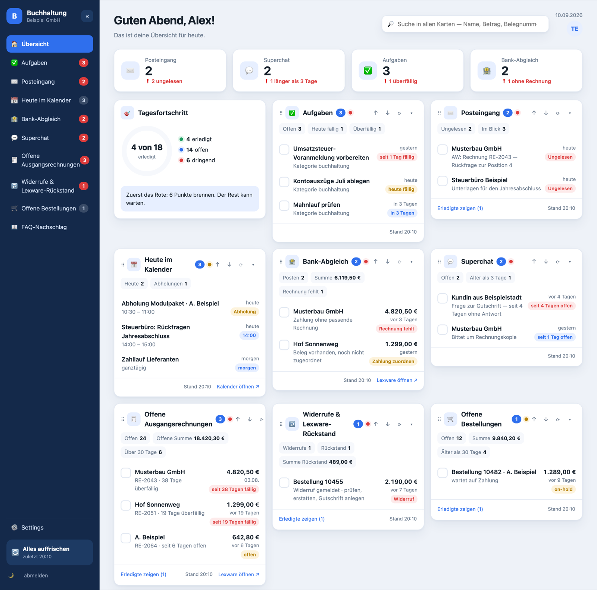

# Mitarbeiter-Dashboard

Eine Seite, auf der eine Person alles sieht, was ihr Tag verlangt: offene
Rechnungen, Bank-Abgleich, Bestellungen, Widerrufe, Aufgaben, Termine,
Posteingang, Kundenanfragen. Jede Kachel ist bedienbar — abhaken, Notiz,
Direktlink ins Fachsystem. Geschrieben wird nur dort, wo es sinnvoll ist; die
Fachsysteme bleiben die Wahrheit.

Python 3.12, FastAPI, Jinja2, SQLite, Vanilla-JS. Kein Build-Schritt, keine
Node-Abhängigkeit. Läuft als ein Container hinter Traefik.



*Beispieldaten. Namen, Beträge und Belegnummern im Bild sind erfunden.*

## Karten entstehen durch Zugangsdaten

**Es gibt nichts zu programmieren, um eine Karte zu bekommen.** Jede Karte
nennt, welche Zugangsdaten sie braucht. Wer sie unter *Settings* einträgt,
sieht die Karte beim nächsten Abruf — ohne Neustart. Wer sie löscht, verliert
sie wieder. Bis dahin steht die Karte unter dem Raster in einer Zeile
„noch nicht eingerichtet".

Das ist Absicht: Eine Karte, die „Nichts offen" zeigt, weil niemand einen
Zugang hinterlegt hat, behauptet Feierabend, wo gar nicht nachgesehen wurde.

| Karte | braucht |
|---|---|
| Offene Ausgangsrechnungen | Lexware/lexoffice API-Schlüssel |
| Bank-Abgleich | Berichte in einem gemounteten Ordner |
| Offene Bestellungen | WooCommerce: Adresse, Key, Secret |
| Widerrufe + Rückstand | Dateien in gemounteten Ordnern, WooCommerce für die Details |
| Aufgaben | Todomaster: MCP-Adresse, Token, Kategorien |
| Heute im Kalender | Google-Kalender-Kennung, dazu eine Google-Anmeldung **oder** ein Dienstkonto-Schlüssel |
| Superchat | API-Schlüssel + eine oder mehrere Postfach-Kennungen |
| Posteingang | mindestens ein Postfach (Anbieter-API oder IMAP), in der Oberfläche angelegt |
| FAQ-Nachschlag | MCP-Adresse der eigenen Wissensbasis |

Die Einträge einer Karte ordnen sich nach Dringlichkeit. Der Knopf `↕` im
Kartenkopf schaltet auf **neueste zuerst** (`⇣`) oder **älteste zuerst** (`⇡`)
um — je Karte einzeln und pro Gerät gemerkt.

Geheimnisse gehen nie an den Browser zurück, nur ihre letzten vier Zeichen.

## Eine Instanz je Person

Derselbe Code läuft mehrfach. Was sich unterscheidet, steht in der `.env`:
Name in der Begrüßung, Kartenliste, Kennzahlen oben, Adresse, Arbeitszeiten.
Jede Instanz hat einen eigenen Ordner, eine eigene `.env` und eine eigene
SQLite-Datei.

```bash
./install.sh --pruefen --host dashboard.example.org   # nur nachsehen
./install.sh --host dashboard.example.org --benutzer alex
```

**Voraussetzungen und Reihenfolge stehen in [INSTALL.md](INSTALL.md)** — vor
allem: der DNS-Eintrag muss **vor** dem ersten Start zeigen, und ein Traefik
mit externem Netz muss schon laufen. Ohne beides startet zwar der Container,
aber niemand erreicht die Seite.

`.env` und `deploy/ziel.env` gehören **nicht** ins Repo — dort stehen Schlüssel
und Serveradressen. Beide sind in `.gitignore`.

## Ausrollen

```bash
./deploy/deploy.sh                     # die Instanz aus DEPLOY_INSTANZ
./deploy/deploy.sh <instanz>           # eine bestimmte
./deploy/deploy.sh <instanz> --dry-run # nur zeigen, was sich ändern würde
```

Übertragen werden ausschließlich Programmdateien; `.env` und `data/` bleiben
unberührt. Danach Neubau und Neustart, am Ende eine Abfrage von `/healthz`.

Weitere Skripte:

- `deploy/zugang-anlegen.sh <name>` legt auf dem Server einen Basic-Auth-Zugang
  an und probiert die Anmeldung anschließend wirklich aus.
  `--pruefen` sagt zu einer bestehenden `.env`, ob ihre Hashes überhaupt
  brauchbar sind — ein kaputter Hash fällt sonst erst auf, wenn sich jemand
  nicht anmelden kann, denn der Container läuft trotzdem und `/healthz`
  meldet grün.
- `deploy/domain-aktivieren.sh <host>` hängt einen Hostnamen an die
  Traefik-Regel — aber erst, wenn mehrere öffentliche Resolver **und** der
  Server selbst die richtige IP liefern. Ein Name, der noch woandershin zeigt,
  lässt das Let's-Encrypt-Zertifikat der ganzen Regel scheitern.

## Aufbau

```
app/main.py         Endpunkte, Kartenaufbau, Lebenszyklus
app/profil.py       wer diese Instanz benutzt, welche Karten sie zeigt
app/quellen/*.py    eine Datei je Karte, alle mit derselben Form
app/cache.py        ein Hintergrund-Takt je Karte; die Oberfläche liest nur Cache
app/verlauf.py      erkennt Erledigtes am Verschwinden zwischen zwei Abrufen
app/db.py           SQLite: Haken, Notizen, Cache, Nachrichten, Postfächer
app/einstellungen.py  Zugangsdaten in der Oberfläche; DB schlägt .env
app/mcp.py          Zugang für eine KI (JSON-RPC, Token im Pfad)
```

Eine neue Karte ist eine Datei in `app/quellen/` plus ein Eintrag in `ALLE`:

```python
NAME, TITEL, ICON, TTL, ANLAUF, LINK, LINK_TEXT, KOPFZAHL, BRAUCHT
def fetch(env) -> {"posten": [...], "kennzahlen": {...}, "hinweis": str|None}
```

## Regeln, die im Code gelten

- **Ein Ausfall leert nie eine Karte.** Schlägt ein Abruf fehl, bleiben die
  alten Daten stehen und die Karte sagt, wie alt ihr Stand ist.
- **Lesen bleibt Lesen.** IMAP holt Kopfzeilen nur mit `BODY.PEEK`, die
  Kalender- und Buchhaltungsabrufe schreiben nichts.
- **ES2018 im Frontend**: kein `?.`, `??`, `flat()`, `fromEntries`, `.at()`,
  `replaceAll`, kein Flex-`gap`. Grund ist ein iPhone 6 im Team; neuere
  Syntax lässt die ganze JS-Datei stumm scheitern.
- **Deutsche Bezeichner, Kommentare begründen.** Im Zweifel steht dort, warum
  etwas so ist, nicht was die Zeile tut.

## Lizenz

Privat. Keine Freigabe zur Weiterverwendung.
